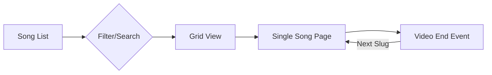

This is a [Next.js](https://nextjs.org) project bootstrapped with [`create-next-app`](https://nextjs.org/docs/app/api-reference/cli/create-next-app).

## Getting Started

First, run the development server:

```bash
npm run dev
# or
yarn dev
# or
pnpm dev
# or
bun dev
```

Open [http://localhost:3000](http://localhost:3000) with your browser to see the result.

You can start editing the page by modifying `app/page.tsx`. The page auto-updates as you edit the file.

This project uses [`next/font`](https://nextjs.org/docs/app/building-your-application/optimizing/fonts) to automatically optimize and load [Geist](https://vercel.com/font), a new font family for Vercel.

## Learn More

To learn more about Next.js, take a look at the following resources:

- [Next.js Documentation](https://nextjs.org/docs) - learn about Next.js features and API.
- [Learn Next.js](https://nextjs.org/learn) - an interactive Next.js tutorial.

You can check out [the Next.js GitHub repository](https://github.com/vercel/next.js) - your feedback and contributions are welcome!

## Deploy on Vercel

The easiest way to deploy your Next.js app is to use the [Vercel Platform](https://vercel.com/new?utm_medium=default-template&filter=next.js&utm_source=create-next-app&utm_campaign=create-next-app-readme) from the creators of Next.js.

Check out our [Next.js deployment documentation](https://nextjs.org/docs/app/building-your-application/deploying) for more details.

## Dynamic Article Page

### Overview
The dynamic article page is located at `app/articles/[slug]/page.tsx`. It is responsible for rendering individual articles based on their unique slug, fetching content from Markdown files in `content/articles/`.

### Key Features
- **Markdown Support**: Renders articles written in Markdown using `react-markdown`.
- **Dynamic Routing**: Uses Next.js dynamic routes `[slug]` to match article URLs.
- **Server-Side Rendering**: Fetches data on the server using `fs` (via `lib/posts.ts`) for optimal performance and SEO.
- **Component Architecture**: 
  - `ShareSidebar` (Client Component) for social sharing.
  - `ArticleUI` (Server Components) for consistent design elements.

### Data Fetching
Articles are stored as `.md` files in `content/articles`. The `getPostBySlug` function reads the file, parses frontmatter (title, date, author, etc.), and passes the content to the page.

### Mermaid Diagram
```mermaid
flowchart TD
    A[User Request /articles/my-post] --> B[app/articles/[slug]/page.tsx]
    B --> C{getPostBySlug}
    C -->|Read file| D[content/articles/my-post.md]
    D -->|Return Data| B
    B --> E[Render Page]
    E --> F[Article Header & Hero]
    E --> G[Markdown Content]
    E --> H[ShareSidebar]
```

## Worship Songs Page

### Overview
The Worship Songs page is located at `app/songs/page.tsx` (using `SongsClient.tsx`). Individual song pages are at `app/songs/[slug]/page.tsx`.

### Key Features
- **YouTube Integration**: Automatically extracts video IDs and high-resolution thumbnails (`maxresdefault.jpg`) from YouTube URLs.
- **Real-time Search**: Instant filtering by title, artist, or song description.
- **Category Filtering**: Dynamic category chips for easy navigation.
- **Auto-Play Playlist**: Sequential playback logic that automatically navigates to the next song when a video ends.
- **Premium UI**: Modern hero section with animated gradients and exit animations via `framer-motion`.

### Technical Implementation
- **Data Source**: Markdown files in `content/songs/`.
- **Thumbnail Handling**: Uses a robust ID extraction utility that handles multiple YouTube URL formats (watch, embed, shortened).
- **Auto-Play**: Calculates an "Up Next" queue based on the current song's index in the global song list.
- **Animations**: Utilizes `AnimatePresence` for smooth grid layout transitions during search/filter operations.

