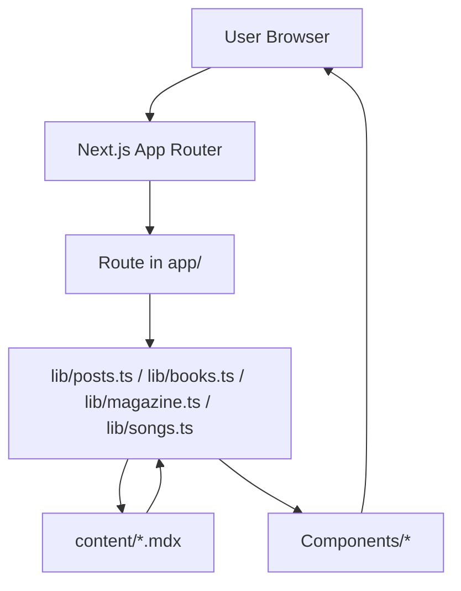

# Project Architecture

## Overview

This project is a content-driven Next.js application that uses the App Router and MDX-based content files for articles, magazines, books, and songs. It combines server components for data fetching with client components for interactive experiences (filters, animations, media playback).

Key characteristics:
- Next.js App Router in the `app/` directory.
- Markdown/MDX content under the `content/` folder.
- Domain-specific loader modules in `lib/` for articles, magazines, books, songs, and categories.
- Reusable UI components in `Components/`.
- Tailwind CSS v4 for styling, with typography enhancements.

## High-Level Module Structure

- `app/`
  - Route segments for home, about, articles, books, magazines, songs, and contact.
  - Server components for initial data loading.
  - Dynamic routes (e.g., `[slug]`) for content detail pages.
- `lib/`
  - `posts.ts`, `magazine.ts`, `books.ts`, `songs.ts`, `category.ts` implement file-system-based content loading and indexing.
- `Components/`
  - Layout (Navbar, Footer), listing UIs (BlogCards, MagazineCard, Category), article chrome (ArticleUI, ShareSidebar), animations (Reveal), and about-page components.
- `content/`
  - MDX files per article, magazine, book, and song with frontmatter for metadata and body for content.

## Runtime Architecture

- Request comes into a specific route (e.g., `/articles`, `/books`, `/magazines`, `/songs`).
- The corresponding server component in `app/` calls into a `lib/*` loader.
- Loaders read MDX files from `content/*`, parse frontmatter (via `gray-matter`) and serialize content (via `next-mdx-remote` or `react-markdown`).
- Data is passed as props into presentational components in `Components/` or client components for interactive behavior.

## Mermaid System Diagram

## Technology Stack

- Next.js (App Router) with MDX support (`@next/mdx`, `next-mdx-remote`).
- React with React Compiler enabled.
- Tailwind CSS v4 + typography plugin.
- `framer-motion` for animations.
- `react-youtube` for media playback.
- ESLint with Next.js presets.
- TypeScript with strict settings.

## Separation of Concerns

- `app/` focuses on routing and coarse-grained layout.
- `lib/` focuses on data access and transformation.
- `Components/` focuses on UI and visual behavior.
- `content/` contains the actual domain content in MDX.

## Extensibility

- New content types can be introduced by adding a `content/<type>/` folder, a `lib/<type>.ts` loader, and corresponding routes and components.
- Styling changes are centralized via Tailwind config and global CSS.
- Navigation and layout updates happen in `app/layout.tsx`, `Components/Navbar.tsx`, and `Components/Footer.tsx`.