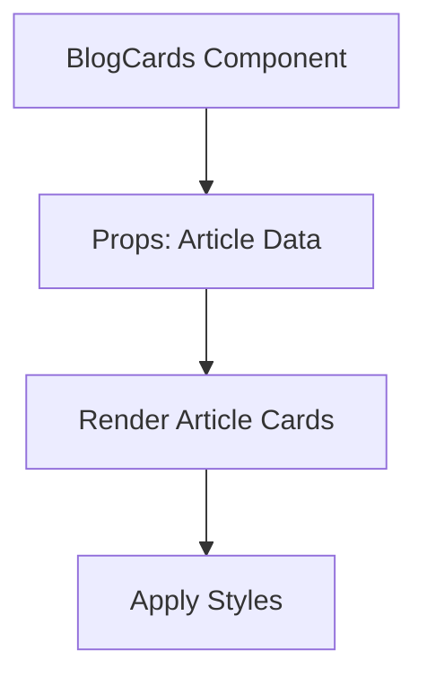

# Documentation for `BlogCards.tsx`

## 1. Overview
This file defines the `BlogCards` component, which is responsible for displaying a preview of blog articles in a card format. It is used to provide a quick overview of articles with titles, summaries, and thumbnails.

## 2. File Location
`src/Components/BlogCards.tsx`

## 3. Key Components
- **BlogCards**: The main component that renders individual article cards.
- **Props**: Accepts article data as props, including title, summary, and image.

## 4. Execution Flow
1. Receives article data as props.
2. Maps over the data to render individual cards.
3. Applies styles and layouts for consistent design.
4. Exports the component for reuse.

## 5. Data Flow
- **Inputs**: Article data passed as props.
- **Processing**: Maps over the data to generate cards.
- **Outputs**: Rendered article cards.
- **Dependencies**: Relies on CSS modules or styled-components for styling.

## 6. Mermaid Diagrams


## 7. Error Handling & Edge Cases
- Handles cases where article data is missing or incomplete.
- Ensures proper rendering even with minimal data.

## 8. Example Usage
```tsx
<BlogCards articles={[
  { title: 'Article 1', summary: 'Summary 1', image: 'image1.jpg' },
  { title: 'Article 2', summary: 'Summary 2', image: 'image2.jpg' }
]} />
```