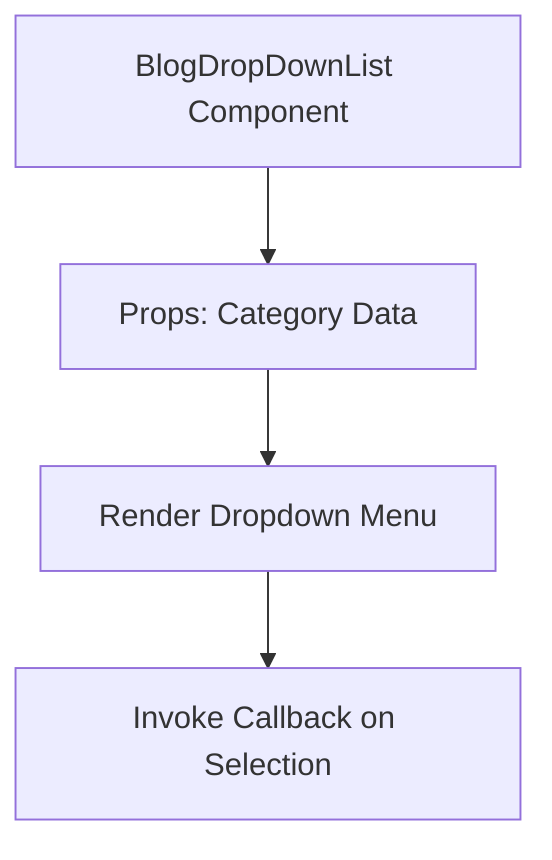

# Documentation for `BlogDropDownList.tsx`

## 1. Overview
This file defines the `BlogDropDownList` component, which provides a dropdown menu for filtering blog articles by category. It enhances user navigation and improves content discoverability.

## 2. File Location
`src/Components/BlogDropDownList.tsx`

## 3. Key Components
- **BlogDropDownList**: The main component that renders the dropdown menu.
- **Props**: Accepts category data and a callback function for handling selection.

## 4. Execution Flow
1. Receives category data and a callback function as props.
2. Renders a dropdown menu with the categories.
3. Invokes the callback function when a category is selected.
4. Exports the component for reuse.

## 5. Data Flow
- **Inputs**: Category data and a callback function passed as props.
- **Processing**: Maps over the category data to generate dropdown options.
- **Outputs**: Selected category passed to the callback function.
- **Dependencies**: Relies on CSS modules or styled-components for styling.

## 6. Mermaid Diagrams


## 7. Error Handling & Edge Cases
- Handles cases where category data is missing or empty.
- Ensures proper rendering even with minimal data.

## 8. Example Usage
```tsx
<BlogDropDownList
  categories={['Tech', 'Health', 'Finance']}
  onSelect={(category) => console.log(`Selected: ${category}`)}
/>
```