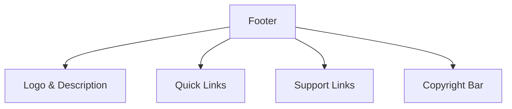

## 1. Overview

- **Purpose**: Renders the global footer with branding, quick links, and support links.
- **Problem it solves**: Provides consistent footer navigation and site information at the bottom of all pages.
- **High-level responsibility**: Show logo, navigation shortcuts, and basic legal/support items.

## 2. File Location

- Source: `Components/Footer.tsx`

## 3. Key Components

- `Footer` (default export)
  - Client component (`"use client"`).
  - Renders:
    - Logo and short description text.
    - Quick links to Home, About, Articles, Magazines, Books, Songs.
    - Support list (Help Center, Privacy Policy, Terms).
    - Bottom bar with dynamic copyright.

## 4. Execution Flow

- On render:
  - Outputs a `<footer>` container with responsive grid layout for content.
  - The current year is computed via `new Date().getFullYear()`.

## 5. Data Flow

- **Inputs**: None.
- **Processing**:
  - Compute current year for display.
- **Outputs**:
  - Footer JSX used across the site.
- **Dependencies**:
  - `next/link` for internal navigation.

## 6. Mermaid Diagrams



## 7. Error Handling & Edge Cases

- No external data, so minimal error surface.
- Assumes `/public/logo.jpg` exists.

## 8. Example Usage

- Used in `app/layout.tsx` after page content:

```tsx
<Footer />
```