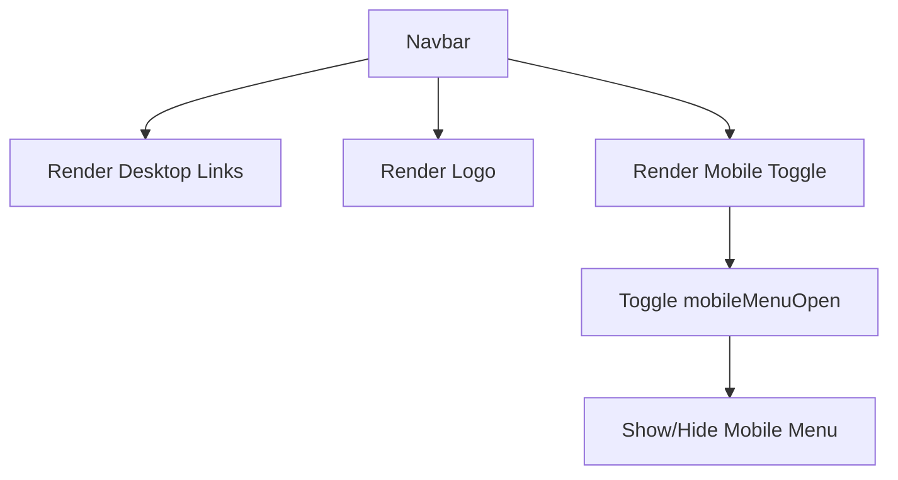

## 1. Overview

- **Purpose**: Renders the top navigation bar with logo and links to main sections of the site.
- **Problem it solves**: Provides consistent, responsive navigation across desktop and mobile devices.
- **High-level responsibility**: Display the site logo, primary navigation links, and a collapsible mobile menu.

## 2. File Location

- Source: `Components/Navbar.tsx`

## 3. Key Components

- `Navbar` (default export)
  - Client component (`"use client"`).
  - Manages `mobileMenuOpen` state for showing/hiding the mobile navigation.
  - Renders:
    - Fixed, blurred background nav bar.
    - Logo linking to `/`.
    - Desktop nav links for Home, About, Articles, Magazines, Books, Songs.
    - Hamburger button that toggles the mobile menu.
    - Mobile menu with stacked links.

## 4. Execution Flow

- On initial render:
  1. `mobileMenuOpen` is `false`.
  2. Navbar is rendered fixed at the top of the viewport.
- On mobile menu button click:
  1. `setMobileMenuOpen` toggles the state.
  2. When `mobileMenuOpen` is true, the mobile menu section is rendered.
  3. Selecting a mobile link triggers `handleClose`, closing the menu.

## 5. Data Flow

- **Inputs**:
  - None; content is static.
- **Processing**:
  - Boolean toggling of `mobileMenuOpen`.
- **Outputs**:
  - Navigation UI and responsive menu behavior.
- **Dependencies**:
  - `next/link` for client-side navigation.
  - React `useState`.

## 6. Mermaid Diagrams



## 7. Error Handling & Edge Cases

- No external data; only manages local boolean state.
- The logo image must exist at `/public/logo.jpg`; otherwise, the image will be broken.

## 8. Example Usage

- Used in `app/layout.tsx` to provide global navigation:

```tsx
<body>
  <Navbar />
  {children}
</body>
```