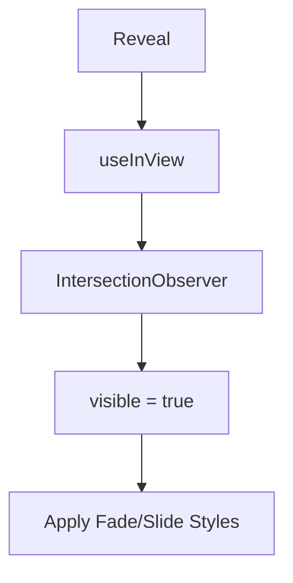

## 1. Overview

- **Purpose**: Provides a generic scroll-reveal wrapper that animates child content into view when it becomes visible.
- **Problem it solves**: Encapsulates `IntersectionObserver` logic and CSS transitions to avoid duplication across components.
- **High-level responsibility**: Observe an element's visibility and apply fade/slide-in animations.

## 2. File Location

- Source: `Components/Reveal.tsx`

## 3. Key Components

- `useInView(threshold?: number)`
  - Internal hook returning `[ref, visible]`.
  - Uses `IntersectionObserver` to set `visible` to `true` once the element intersects the viewport.
- `Reveal` (exported component)
  - Props: `{ children, delay?, className? }`.
  - Attaches `ref` from `useInView` to a wrapper `<div>`.
  - Applies inline `opacity`, `transform`, and `transition` styles based on `visible` state and `delay`.

## 4. Execution Flow

- On mount:
  1. `useInView` creates an `IntersectionObserver` targeting the referenced element.
  2. When the element becomes visible at or above the threshold, `visible` is set to true.
- On render:
  1. `Reveal` wraps `children` in a `<div>`.
  2. Before visibility, the wrapper is translated down and transparent.
  3. After visibility, the wrapper transitions to full opacity and zero translation.

## 5. Data Flow

- **Inputs**:
  - `threshold` (optional), `delay`, and arbitrary `children`.
- **Processing**:
  - Browser intersection observation.
- **Outputs**:
  - Animated wrapper around children.
- **Dependencies**:
  - React hooks (`useEffect`, `useRef`, `useState`).
  - `IntersectionObserver` API in the browser.

## 6. Mermaid Diagrams



## 7. Error Handling & Edge Cases

- Does not guard for environments without `IntersectionObserver` (e.g., some older browsers or SSR), but is typically used client-side.

## 8. Example Usage

```tsx
<Reveal delay={0.1}>
  <SectionContent />
</Reveal>
```