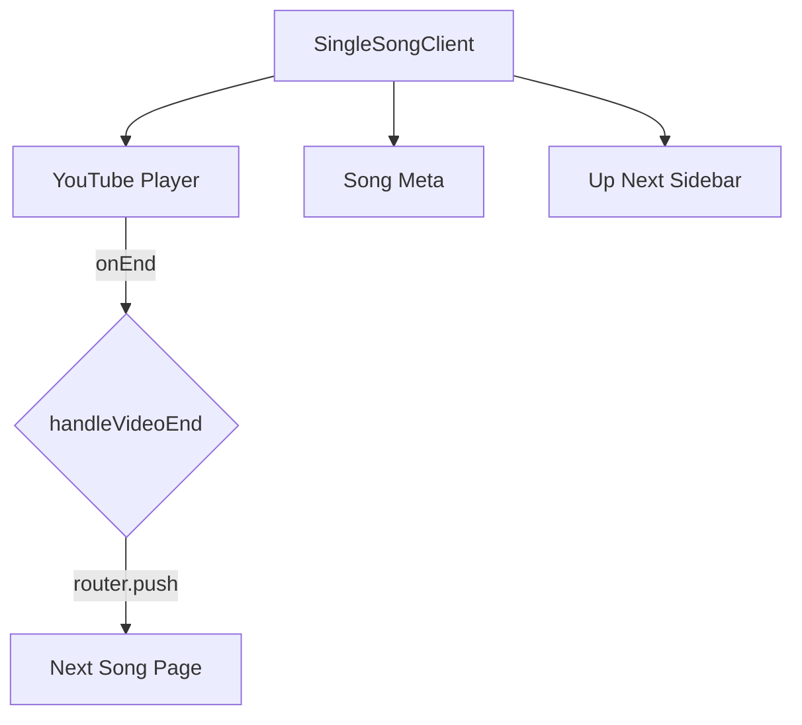

# Documentation for `SingleSongClient.tsx`

## 1. Overview
The `SingleSongClient` component is responsible for rendering the individual song playback experience. It integrates a YouTube player, displays song metadata, and manages an "Up Next" sidebar for continuous playback.

## 2. File Location
`app/songs/[slug]/SingleSongClient.tsx`

## 3. Key Features
- **YouTube Integration**: Uses the `react-youtube` library to embed a responsive video player.
- **Auto-Play Sequential Logic**: Automatically navigates to the next song in the sequence when the current video finishes.
- **Ordered "Up Next" List**: Dynamically generates a queue starting from the song immediately following the current one in the alphabetical/database list, ensuring a non-looping continuous flow.
- **Responsive Layout**: Adapts the video player and sidebar for mobile and desktop views, ensuring the player is prominent.
- **Social Sharing**: Integrates the Web Share API (with a clipboard fallback) for easy sharing of song pages.

## 4. Execution Flow
1. Receives the current `song` and the list of `allSongs`.
2. Computes the `upNext` list by finding the current song's index and slicing the array to wrap around.
3. Renders the YouTube player with `autoplay` and `rel: 0` settings.
4. If the video ends (`onEnd`), the `handleVideoEnd` function triggers a router push to the next song's slug.
5. Displays the title, artist, and description of the song.
6. Renders the "Up Next" list in a sidebar (desktop) or below the content (mobile).

## 5. Data Flow
- **Props**:
  - `song`: The current `Song` object.
  - `allSongs`: Array of all `Song` objects for queue building.
- **Internal Logic**:
  - `getYouTubeId(url)`: Extracts the ID similarly to the list page utility.
  - `handleVideoEnd()`: Executes navigation.
- **Outputs**: Comprehensive song playback and discovery interface.

## 6. Mermaid Diagrams

