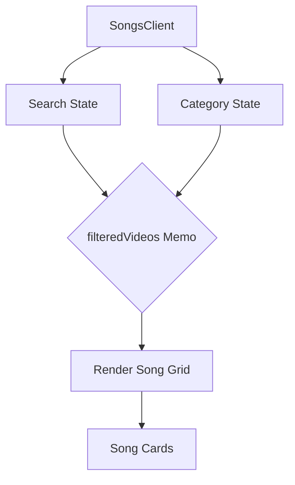

# Documentation for `SongsClient.tsx`

## 1. Overview
The `SongsClient` component is a client-side component responsible for rendering the main songs list interface. It includes search functionality, category filtering, and a responsive grid of song cards.

## 2. File Location
`app/songs/SongsClient.tsx`

## 3. Key Features
- **Search Logic**: Filters songs in real-time based on title, artist, or description.
- **Category Filtering**: Allows users to filter songs by predefined categories extracted from the song data.
- **YouTube Thumbnails**: Automatically generates thumbnail URLs using YouTube video IDs extracted from the song URLs.
- **Framer Motion Animations**: Provides smooth transitions for filtering and searching using `AnimatePresence` and `motion` components.

## 4. Execution Flow
1. Receives `initialVideos` as props.
2. Manages `selectedCategory` and `searchQuery` state.
3. Uses `useMemo` to compute `filteredVideos` based on both category and search query.
4. Renders a hero section with a search bar and category chips.
5. Renders a grid of songs. Each song is wrapped in a `Link` and a `motion.div` for entry/exit animations.

## 5. Data Flow
- **Props**: `initialVideos` (Array of `Song` objects).
- **Internal State**:
  - `selectedCategory`: String (default "All").
  - `searchQuery`: String (default "").
- **Outputs**: Interactive UI for browsing worship songs.

## 6. Mermaid Diagrams

## 7. HelperFunctions
- **extractYouTubeId(url)**: A utility function that parses various YouTube URL formats to retrieve the 11-character video ID. It decodes HTML entities and handles different URL patterns (watch, embed, v).
