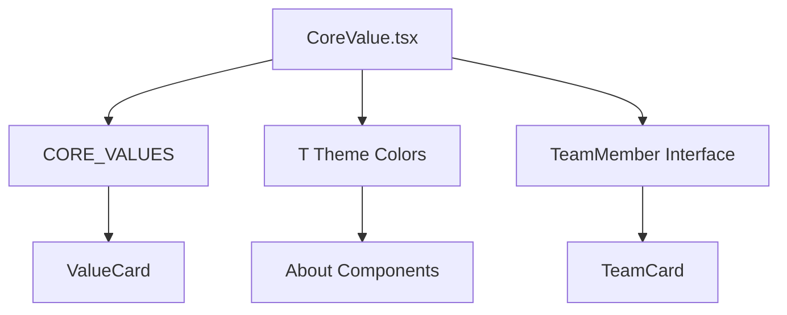

## 1. Overview

- **Purpose**: Defines core types, constants, and configuration data for the About page.
- **Problem it solves**: Centralizes the site’s core value definitions, color palette, and team member type for reuse across About-related components.
- **High-level responsibility**: Export `CORE_VALUES`, color theme `T`, and the `TeamMember` interface.

## 2. File Location

- Source: `Components/about/CoreValue.tsx`

## 3. Key Components

- `CoreValue` interface
  - Describes a core value with `icon`, `title`, and `desc`.
- `CORE_VALUES: CoreValue[]`
  - Array of core values (Theological Rigor, Spiritual Depth, Community, Relevance, Dialogue, Excellence).
- `T`
  - Color theme object for About page components (navy, gold, burgundy, gray shades).
- `TeamMember` interface
  - Describes team members used in `TeamCard` and About page: `name`, `role`, `bio`, `hue`.

## 4. Execution Flow

- There is no runtime logic; this file only exports configuration and type definitions used by About components.

## 5. Data Flow

- **Inputs**: None.
- **Processing**: Static declarations only.
- **Outputs**:
  - `CORE_VALUES` and color palette used by `ValueCard` and About page.
  - `TeamMember` type used by About page and `TeamCard`.

## 6. Mermaid Diagrams



## 7. Error Handling & Edge Cases

- Pure configuration; no runtime error handling needed.

## 8. Example Usage

```ts
import { CORE_VALUES, T, TeamMember } from "../../Components/about/CoreValue";
```