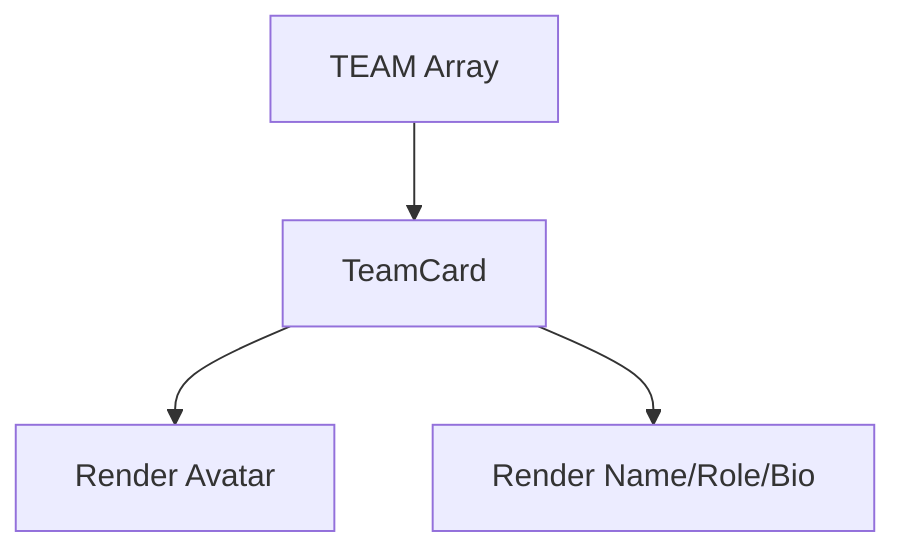

## 1. Overview

- **Purpose**: Renders individual team member cards for the About page.
- **Problem it solves**: Encapsulates layout, hover animation, and styling for team members.
- **High-level responsibility**: Accept `TeamMember` props and display avatar, name, role, and bio.

## 2. File Location

- Source: `Components/about/MeetTeam.tsx`

## 3. Key Components

- `TeamCard` (exported)
  - Props: `TeamMember` (from `CoreValue.tsx`): `name`, `role`, `bio`, `hue`.
  - Internal state: `hovered` boolean to control animation and shadow.
  - Visuals:
    - Square avatar box with gradient background and hard-coded image.
    - Name, role, and bio with theme colors from `T`.

## 4. Execution Flow

- On render:
  1. Computes `initials` from `name` (currently not displayed due to a commented-out span).
  2. Displays an avatar image inside a gradient-backed container.
  3. Shows name, role, and bio text.
- On mouse enter/leave:
  1. Toggles `hovered` to animate vertical translation and shadow.

## 5. Data Flow

- **Inputs**:
  - Team member data from the `TEAM` array in the About page module.
- **Processing**:
  - Simple transformation from `name` to `initials` (not currently rendered).
- **Outputs**:
  - JSX representing a single team member card.
- **Dependencies**:
  - Theme colors from `CoreValue.tsx` (`T`).

## 6. Mermaid Diagrams



## 7. Error Handling & Edge Cases

- Assumes `name`, `role`, and `bio` are provided.
- Avatar image URL is hard-coded; if unavailable, the image will be broken.

## 8. Example Usage

- Used in the About page:

```tsx
TEAM.map((m, i) => <TeamCard key={m.name} {...m} />)
```