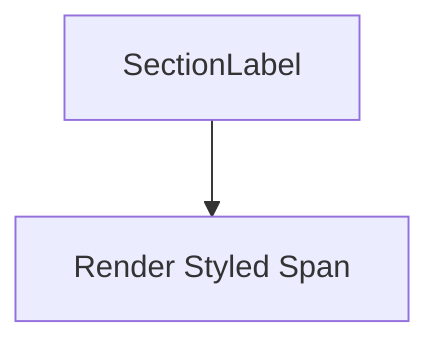

## 1. Overview

- **Purpose**: Small helper component to render styled section labels on the About page.
- **Problem it solves**: Avoids duplicating typography and spacing for section labels.
- **High-level responsibility**: Wrap `children` in a styled `<span>` with theme color and tracking.

## 2. File Location

- Source: `Components/about/SectionLabel.tsx`

## 3. Key Components

- `SectionLabel` (exported)
  - Props: `{ children: React.ReactNode }`.
  - Renders a block-level span with uppercase, tracking, and themed color.

## 4. Execution Flow

- On render:
  - Outputs a consistently styled label preceding section headings.

## 5. Data Flow

- **Inputs**: Child text or elements.
- **Processing**: None.
- **Outputs**: JSX span.
- **Dependencies**:
  - `T` color palette from `CoreValue.tsx`.

## 6. Mermaid Diagrams



## 7. Error Handling & Edge Cases

- No logic; minimal risk.

## 8. Example Usage

```tsx
<SectionLabel>Our Mission</SectionLabel>
```