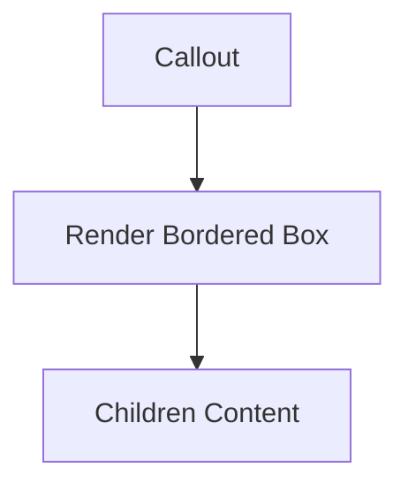

## 1. Overview

- **Purpose**: Simple MDX helper component to highlight content in a callout box.
- **Problem it solves**: Provides a reusable visual style for emphasized notes within MDX articles.
- **High-level responsibility**: Wrap child content in a bordered, colored container.

## 2. File Location

- Source: `Components/mdx-components/Callout.tsx`

## 3. Key Components

- `Callout` (default export)
  - Props: `{ children: React.ReactNode }`.
  - Renders a styled `<div>` with blue border and background.

## 4. Execution Flow

- On render, the component simply wraps `children` in a Tailwind-styled `div`.

## 5. Data Flow

- **Inputs**: Arbitrary child nodes.
- **Processing**: None.
- **Outputs**: Highlighted callout box.

## 6. Mermaid Diagrams



## 7. Error Handling & Edge Cases

- No logic; minimal risk.

## 8. Example Usage

- Used in MDX via component mapping:

```mdx
<Callout>
Important note here.
</Callout>
```