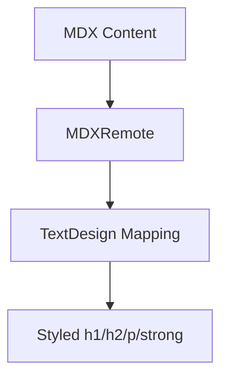

## 1. Overview

- **Purpose**: Provides a set of React components to customize typography for MDX-rendered content.
- **Problem it solves**: Ensures consistent heading, paragraph, and strong text styles across MDX articles.
- **High-level responsibility**: Export a mapping object for `MDXRemote`/`MDXProvider` to override default HTML tags.

## 2. File Location

- Source: `Components/mdx-components/TextDesign.tsx`

## 3. Key Components

- `TextDesign`
  - Object whose keys correspond to MDX/HTML elements and values are React component functions:
    - `h1`: Large, bold blue heading.
    - `h2`: Slightly smaller gray heading.
    - `p`: Base paragraph with comfortable line height.
    - `strong`: Highlighted strong text in red.

## 4. Execution Flow

- When `MDXRemote`/`MDXProvider` is configured with `components={{ ...TextDesign }}`:
  1. MDX heading and paragraph tags are rendered using the provided React wrappers.
  2. Tailwind classes control font size, color, and spacing.

## 5. Data Flow

- **Inputs**: Incoming MDX props for `h1`, `h2`, `p`, and `strong`.
- **Processing**: Spread props into styled components.
- **Outputs**: Consistently styled text elements.

## 6. Mermaid Diagrams



## 7. Error Handling & Edge Cases

- No logic or side effects; errors would stem from misconfiguration in MDX integration.

## 8. Example Usage

```tsx
<MDXRemote source={content} components={{ ...TextDesign }} />
```