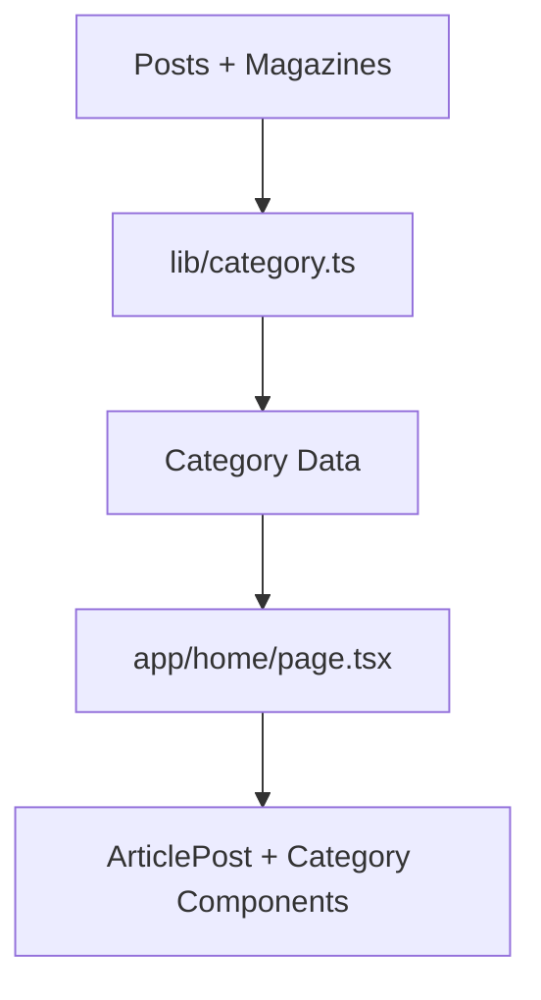

# Project Data Flow

## Overview

Data in this application flows from static MDX files in the `content/` directory through domain-specific loaders in `lib/` and into React components rendered by Next.js routes in `app/`. This document summarizes those flows for each major content domain: articles, magazines, books, and songs.

## Articles

1. Source: MDX files in `content/articles/*.mdx`.
2. Loader: `lib/posts.ts` reads files, parses frontmatter (`gray-matter`), and constructs `Post` objects.
3. List page: `app/articles/page.tsx` calls `getAllPosts()` and passes posts to `ArticlesClient` or presentational components.
4. Detail page: `app/articles/[slug]/page.tsx` uses `getPostBySlug()` and renders content with `next-mdx-remote`.

```mermaid
flowchart TD
    A[content/articles/*.mdx] --> B[lib/posts.ts]
    B --> C[app/articles/page.tsx]
    B --> D[app/articles/[slug]/page.tsx]
    C --> E[ArticlesClient + BlogCards]
    D --> F[ArticleUI + MDX Renderer]
```

## Magazines

1. Source: MDX files in `content/magazine/*.mdx`.
2. Loader: `lib/magazine.ts` aggregates magazine metadata and content.
3. List page: `app/magazines/page.tsx` renders magazine cards.
4. Detail page: `app/magazines/[slug]/page.tsx` renders a single magazine using MDX.

```mermaid
flowchart TD
    M1[content/magazine/*.mdx] --> M2[lib/magazine.ts]
    M2 --> M3[app/magazines/page.tsx]
    M2 --> M4[app/magazines/[slug]/page.tsx]
    M3 --> M5[MagazineCard List]
    M4 --> M6[Magazine Detail View]
```

## Books

1. Source: MDX files in `content/books/*.mdx`.
2. Loader: `lib/books.ts` reads frontmatter and body, using `react-markdown` for rendering.
3. List page: `app/books/page.tsx` calls `getAllBooks()` and passes data to `BooksClient`.
4. Detail page: `app/books/[slug]/page.tsx` fetches a single book via `getBookBySlug()` and delegates rendering to `BookDetailClient`.

```mermaid
flowchart TD
    B1[content/books/*.mdx] --> B2[lib/books.ts]
    B2 --> B3[app/books/page.tsx]
    B2 --> B4[app/books/[slug]/page.tsx]
    B3 --> B5[BooksClient Grid]
    B4 --> B6[BookDetailClient]
```

## Songs

1. Source: MDX files in `content/songs/*.mdx`.
2. Loader: `lib/songs.ts` parses metadata (title, slug, YouTube URL, etc.).
3. List page: `app/songs/page.tsx` fetches all songs and passes them to `SongsClient`.
4. Detail page: `app/songs/[slug]/page.tsx` retrieves a single song and renders it via `SingleSongClient` with `react-youtube`.

```mermaid
flowchart TD
    S1[content/songs/*.mdx] --> S2[lib/songs.ts]
    S2 --> S3[app/songs/page.tsx]
    S2 --> S4[app/songs/[slug]/page.tsx]
    S3 --> S5[SongsClient]
    S4 --> S6[SingleSongClient]
```

## Categories and Home Page

- `lib/category.ts` combines posts and magazine entries into category groupings.
- `app/home/ArticlePost.tsx` and `Components/Category.tsx` use posts and categories to render home sections.



## Error Handling

- Most loaders assume valid MDX files and throw if files are missing or parse fails.
- Next.js will surface these as build or runtime errors.

## Summary

- All domain data originates from MDX files.
- `lib/` modules define the canonical data shapes.
- `app/` routes fetch data and compose page-level layouts.
- `Components/` handle the visual and interactive rendering of that data.