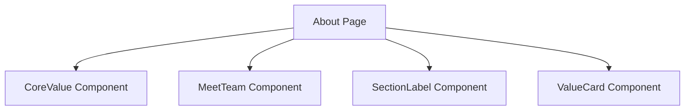

# Documentation for `page.tsx`

## 1. Overview
This file represents the `About` page of the application. It is responsible for displaying information about the organization, its values, and its team. The file structures the content and integrates reusable components to ensure a consistent design.

## 2. File Location
`src/app/about/page.tsx`

## 3. Key Components
- **CoreValue**: Displays the core values of the organization.
- **MeetTeam**: Introduces the team members.
- **SectionLabel**: Provides labeled sections for better readability.
- **ValueCard**: Represents individual values in a card format.

## 4. Execution Flow
1. Imports necessary components and styles.
2. Defines the `About` page layout.
3. Renders the components in a structured format.
4. Exports the page as the default export.

## 5. Data Flow
- **Inputs**: None directly; relies on imported components.
- **Processing**: Combines components to form the page layout.
- **Outputs**: Rendered `About` page.
- **Dependencies**: Relies on components from `src/Components/about`.

## 6. Mermaid Diagrams

## 7. Error Handling & Edge Cases
- Ensures all components render correctly.
- Handles missing or incomplete data gracefully.

## 8. Example Usage
This file is used as part of the Next.js routing system. Navigating to `/about` renders this page.