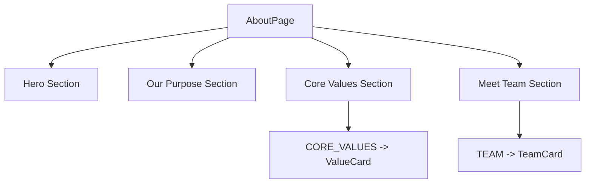

## 1. Overview

- **Purpose**: Renders the "About" page, including mission statement, purpose, core values, and team members.
- **Problem it solves**: Provides a structured page to communicate the story, mission, and people behind the platform.
- **High-level responsibility**: Compose multiple about-related components (`SectionLabel`, `ValueCard`, `TeamCard`, etc.) into a multi-section layout with animations.

## 2. File Location

- Source: `app/about/page.tsx`

## 3. Key Components

- `AboutPage` (default export)
  - Client component (`"use client"`) that:
    - Manages a `mounted` state to trigger entry animations.
    - Renders hero section, purpose section, core values, and team sections.
- `TEAM`
  - Local constant array of `TeamMember` objects, representing people shown in the "Meet Our Team" section.
- Imported components and types:
  - `CORE_VALUES`, `T`, `TeamMember` from `Components/about/CoreValue`.
  - `TeamCard` from `Components/about/MeetTeam`.
  - `SectionLabel` from `Components/about/SectionLabel`.
  - `ValueCard` from `Components/about/ValueCard`.
  - `Reveal` from `Components/Reveal` to animate sections.
  - `Image` from `next/image` for responsive images.

## 4. Execution Flow

- On initial render:
  1. `mounted` is initialized to `false`.
  2. `useEffect` schedules a timeout to set `mounted` to `true` after a short delay, enabling entry animations.
- The component returns a root `
` with page-level background and font styling.
- Within the root:
  - **Hero section**: Mission label, title, and introductory paragraph with animated entry.
  - **Our Purpose section**: Two-column layout with text and imagery, wrapped in `Reveal` for scroll/entry animations.
  - **Core Values section**: Displays `CORE_VALUES` using `ValueCard` in a responsive grid.
  - **Meet Team section**: Maps over `TEAM` array and renders `TeamCard` components.

## 5. Data Flow

- **Inputs**:
  - Static configuration and constants (`CORE_VALUES`, `TEAM`, color palette `T`).
- **Processing**:
  - Local state `mounted` toggles CSS transforms and opacity for animation.
  - Arrays `CORE_VALUES` and `TEAM` are iterated to generate value cards and team member cards.
- **Outputs**:
  - JSX for a full, animated About page.
- **Dependencies**:
  - Next.js `Image` component.
  - Local UI components (`Reveal`, about subcomponents) for layout and animation.

## 6. Mermaid Diagrams

## 7. Error Handling & Edge Cases

- No explicit error handling is implemented.
- Uses static data, so primary risks are layout issues or missing component imports rather than runtime data errors.

## 8. Example Usage

- This page is automatically used by Next.js for the `/about` route. It is not intended to be imported elsewhere.
