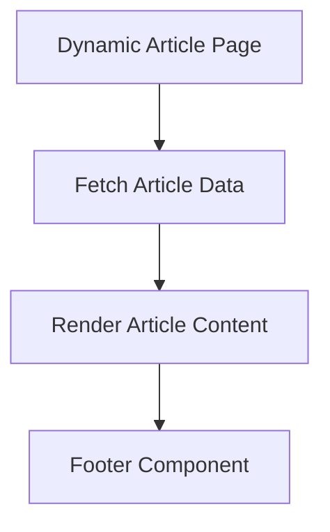

# Documentation for `[id]/page.tsx`

## 1. Overview
This file represents the dynamic route for individual articles. It is responsible for displaying the content of a specific article based on its ID.

## 2. File Location
`src/app/articles/[id]/page.tsx`

## 3. Key Components
- **ArticleContent**: Displays the main content of the article.
- **Footer**: Provides navigation and additional links.

## 4. Execution Flow
1. Fetches the article data based on the dynamic `id` parameter.
2. Renders the article content.
3. Exports the page as the default export.

## 5. Data Flow
- **Inputs**: `id` parameter from the URL.
- **Processing**: Fetches and processes article data.
- **Outputs**: Rendered article page.
- **Dependencies**: Relies on data-fetching utilities and components.

## 6. Mermaid Diagrams

## 7. Error Handling & Edge Cases
- Handles cases where the article ID is invalid.
- Displays a fallback message if the article is not found.

## 8. Example Usage
This file is used as part of the Next.js dynamic routing system. Navigating to `/articles/{id}` renders the specific article.