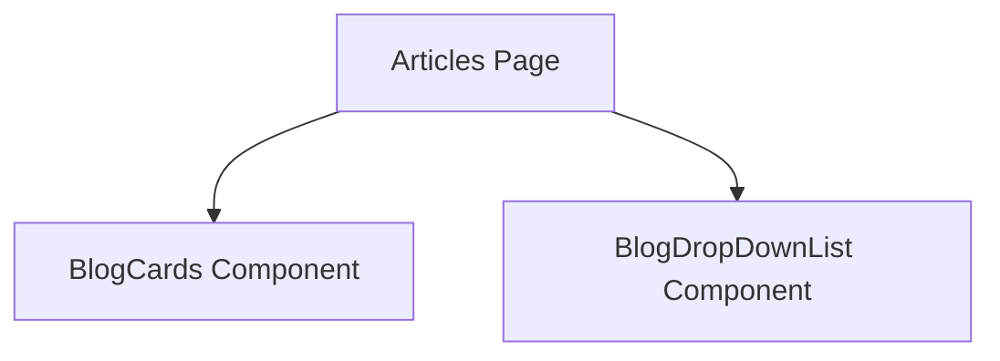

# Documentation for `page.tsx`

## 1. Overview
This file represents the `Articles` page of the application. It is responsible for displaying a list of articles or blog posts. The page provides navigation to individual articles.

## 2. File Location
`src/app/articles/page.tsx`

## 3. Key Components
- **BlogCards**: Displays a preview of each article.
- **BlogDropDownList**: Allows filtering articles by category.

## 4. Execution Flow
1. Imports necessary components and styles.
2. Fetches or receives article data.
3. Renders the list of articles using `BlogCards`.
4. Exports the page as the default export.

## 5. Data Flow
- **Inputs**: Article data (could be fetched or passed as props).
- **Processing**: Maps over the data to render article previews.
- **Outputs**: Rendered `Articles` page.
- **Dependencies**: Relies on components from `src/Components`.

## 6. Mermaid Diagrams

## 7. Error Handling & Edge Cases
- Handles cases where no articles are available.
- Ensures proper rendering of components.

## 8. Example Usage
This file is used as part of the Next.js routing system. Navigating to `/articles` renders this page.