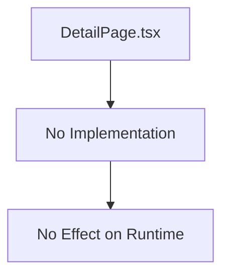

## 1. Overview

- **Purpose**: Placeholder file for a book detail page layout; currently contains no implementation.
- **Problem it solves**: Reserved spot for potential future refactor of the book detail UI into a shared component.
- **High-level responsibility**: None yet; acts as a stub.

## 2. File Location

- Source: `app/books/DetailPage.tsx`

## 3. Key Components

- No exported components or functions at this time.

## 4. Execution Flow

- Not used in the current routing or rendering flow.

## 5. Data Flow

- None; no logic implemented.

## 6. Mermaid Diagrams

## 7. Error Handling & Edge Cases

- As long as it is not imported or used, this file has no runtime impact.

## 8. Example Usage

- Future example: could be imported by `app/books/[slug]/page.tsx` to render a reusable book detail layout once implemented.