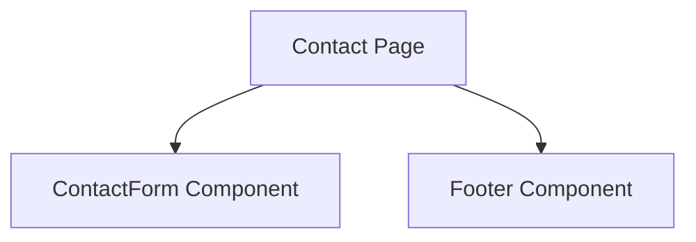

# Documentation for `page.tsx`

## 1. Overview
This file represents the `Contact` page of the application. It is responsible for providing users with a way to contact the organization, including forms and contact details.

## 2. File Location
`src/app/contact/page.tsx`

## 3. Key Components
- **ContactForm**: Allows users to submit inquiries.
- **Footer**: Displays additional contact information and links.

## 4. Execution Flow
1. Imports necessary components and styles.
2. Defines the `Contact` page layout.
3. Renders the contact form and additional information.
4. Exports the page as the default export.

## 5. Data Flow
- **Inputs**: User input from the contact form.
- **Processing**: Validates and processes form submissions.
- **Outputs**: Sends inquiries to the backend or displays confirmation.
- **Dependencies**: Relies on form-handling utilities and components.

## 6. Mermaid Diagrams

## 7. Error Handling & Edge Cases
- Validates user input to prevent invalid submissions.
- Handles backend errors gracefully.

## 8. Example Usage
This file is used as part of the Next.js routing system. Navigating to `/contact` renders this page.