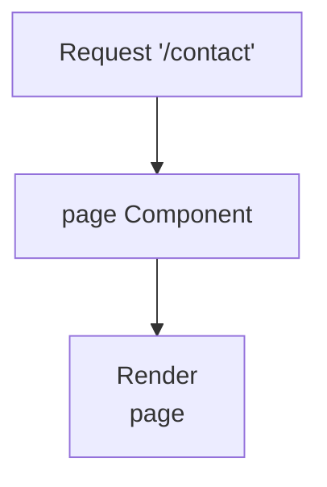

## 1. Overview

- **Purpose**: Placeholder contact page component.
- **Problem it solves**: Currently minimal; reserved for future contact form or information.
- **High-level responsibility**: Render a basic `page` component for the `/contact` route.

## 2. File Location

- Source: `app/contact/page.tsx`

## 3. Key Components

- `page` (default export)
  - Functional React component returning a simple `
page
`.

## 4. Execution Flow

- On navigation to `/contact`, Next.js renders this component which simply outputs a div with the text `page`.

## 5. Data Flow

- **Inputs**: None.
- **Processing**: None beyond rendering static text.
- **Outputs**: Static JSX.
- **Dependencies**: React.

## 6. Mermaid Diagrams

## 7. Error Handling & Edge Cases

- No logic or data; no error handling required.

## 8. Example Usage

- Automatically used as the `/contact` route.
