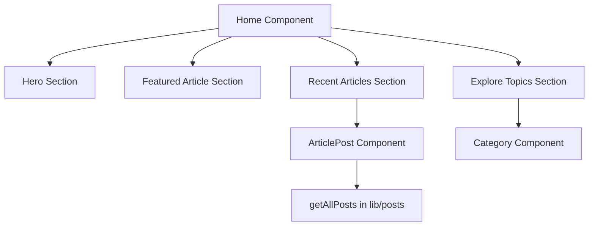

## 1. Overview

- **Purpose**: Implements the main home page experience, including hero section, featured article, recent articles, and topic categories.
- **Problem it solves**: Provides a visually rich landing page that introduces the site, highlights content, and guides users to articles and categories.
- **High-level responsibility**: Compose multiple UI sections and components (`ArticlePost`, `Category`) into a cohesive home page.

## 2. File Location

- Source: `app/home/page.tsx`

## 3. Key Components

- `Home` (default export)
  - Functional React component that renders:
    - Hero section with branding, description, and calls to action.
    - Featured article panel with imagery and metadata.
    - Recent articles section powered by `ArticlePost`.
    - Category explorer powered by `Category`.
- `ArticlePost`
  - Imported from `./ArticlePost`; responsible for fetching and rendering recent article cards.
- `Category`
  - Imported from `../../Components/Category`; renders topic/category exploration UI.
- `Link`, `Image`
  - Next.js components for client-side navigation and optimized images.

## 4. Execution Flow

- `Home` renders a React fragment containing three main sections:
  1. **Hero Section**
     - Background gradient and decorative SVG pattern.
     - Main heading and subtitle text.
     - Description paragraph and CTA buttons ("Explore Articles" and "Learn More").
     - Scroll indicator at the bottom.
  2. **Featured Article Section**
     - Two-column layout: article image and content (title, description, author, date, read time, CTA).
  3. **Recent Articles Section**
     - Section header and a link to `/articles`.
     - Renders `<ArticlePost />`, which loads and displays recent posts.
  4. **Explore Topics Section**
     - Section header for browsing by category.
     - Renders `<Category />` component.
- Inline `<style>` blocks define custom fonts and animations for UI elements.

## 5. Data Flow

- **Inputs**:
  - No props are passed to `Home` directly.
- **Processing**:
  - UI is statically defined; dynamic data for articles comes from `ArticlePost` and `getAllPosts` in `lib/posts`.
- **Outputs**:
  - JSX for a multi-section home page.
- **Dependencies**:
  - `next/image`, `next/link`.
  - `ArticlePost` component.
  - `Category` component.

## 6. Mermaid Diagrams



## 7. Error Handling & Edge Cases

- No explicit error handling logic in this file.
- If `ArticlePost` or `Category` fail (e.g., due to data fetching issues), rendering errors will propagate to Next.js error boundaries.
- The hero and featured sections rely on static data and therefore have minimal runtime error surface.

## 8. Example Usage

- `Home` is used by `app/page.tsx` as the main page for the root route:

```tsx
import Home from "./home/page";

export default function Page() {
  return <Home />;
}
```
