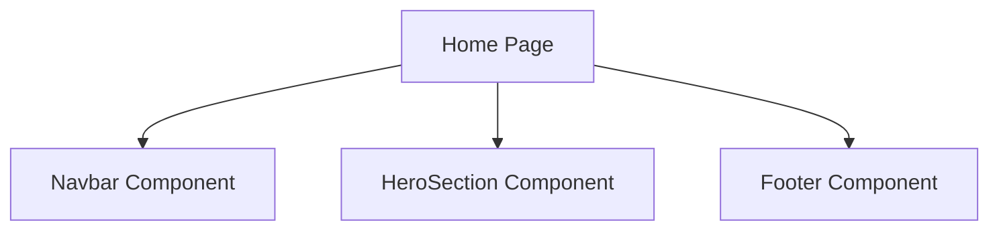

# Documentation for `page.tsx`

## 1. Overview
This file represents the `Home` page of the application. It serves as the landing page, providing an overview of the website and its key features.

## 2. File Location
`src/app/home/page.tsx`

## 3. Key Components
- **Navbar**: Provides navigation links to other pages.
- **Footer**: Displays additional information and links.
- **HeroSection**: Highlights the main features of the website.

## 4. Execution Flow
1. Imports necessary components and styles.
2. Defines the `Home` page layout.
3. Renders the hero section, navigation, and footer.
4. Exports the page as the default export.

## 5. Data Flow
- **Inputs**: None directly; relies on imported components.
- **Processing**: Combines components to form the page layout.
- **Outputs**: Rendered `Home` page.
- **Dependencies**: Relies on components from `src/Components`.

## 6. Mermaid Diagrams

## 7. Error Handling & Edge Cases
- Ensures all components render correctly.
- Handles missing or incomplete data gracefully.

## 8. Example Usage
This file is used as part of the Next.js routing system. Navigating to `/home` renders this page.