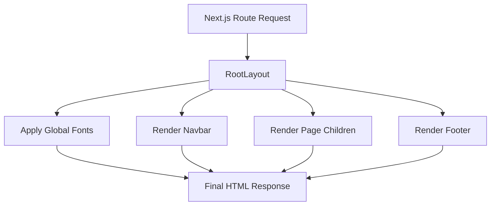

## 1. Overview

- **Purpose**: Defines the root layout for the Next.js app, applying global fonts, styles, and shared layout elements.
- **Problem it solves**: Centralizes global UI concerns (navigation, footer, typography) so individual pages focus on content.
- **High-level responsibility**: Wraps all page content with consistent HTML, body styling, navbar, and footer.

## 2. File Location

- Source: `app/layout.tsx`

## 3. Key Components

- `metadata` (exported `Metadata` object)
  - Describes the default page title and description for the site.
- `RootLayout` (default export)
  - React component that renders the root HTML structure, applies fonts, and injects shared layout components.
- `geistSans`, `geistMono`
  - Font configuration objects created via `next/font/google`, used to define CSS variables for typography.

## 4. Execution Flow

- Next.js uses `RootLayout` as the top-level layout for all routes in the `app` directory.
- Google fonts `Geist` and `Geist_Mono` are configured and their CSS variables are applied to the `<body>` element.
- Global styles from `./globals.css` are imported once here.
- The layout renders:
  - `<Navbar />` at the top.
  - A wrapper `<div className="mt-12">` containing the current route's `children`.
  - `<Footer />` at the bottom.

## 5. Data Flow

- **Inputs**:
  - `children`: React nodes for the current page, provided automatically by Next.js.
- **Processing**:
  - Fonts are initialized and their CSS variables concatenated into the `className` for `<body>`.
- **Outputs**:
  - A complete HTML document structure (`<html>`, `<body>`) with consistent layout and styling.
- **Dependencies**:
  - `next` for `Metadata` type.
  - `next/font/google` for font loading.
  - Local components `Components/Navbar` and `Components/Footer`.
  - `./globals.css` for global Tailwind/CSS styles.

## 6. Mermaid Diagrams



## 7. Error Handling & Edge Cases

- There is no explicit error handling in this file; errors in child components or font loading are handled by Next.js runtime.
- If `Navbar` or `Footer` throw, the error boundary (if configured elsewhere) will handle the failure.

## 8. Example Usage

- `RootLayout` is not imported manually; Next.js automatically uses it for app routing.
- Example of how page content appears inside `children`:

```tsx
export default function Page() {
  return <main>My page content</main>;
}
```
