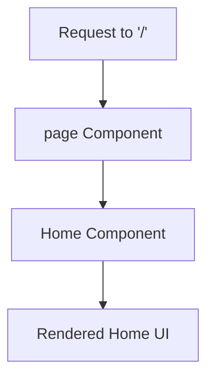

## 1. Overview

- **Purpose**: Defines the default index route (`/`) of the application.
- **Problem it solves**: Delegates the home page UI to the `app/home/page.tsx` component while keeping the root route minimal.
- **High-level responsibility**: Wraps and renders the `Home` component as the main content for the root path.

## 2. File Location

- Source: `app/page.tsx`

## 3. Key Components

- `page` (default export)
  - Functional React component that renders the `Home` component inside a `
`.
- `Home`
  - Imported from `./home/page`, responsible for the full home page UI.

## 4. Execution Flow

- When a user navigates to `/`, Next.js invokes the default export in this file.
- The `page` component renders a `
` containing the `Home` component.
- The `Home` component (from `app/home/page.tsx`) produces the full UI for the home screen.

## 5. Data Flow

- **Inputs**:
  - No props or external data are passed directly to `page`.
- **Processing**:
  - The function simply returns JSX that includes `<Home />`.
- **Outputs**:
  - JSX representing the root page content.
- **Dependencies**:
  - React.
  - `Home` component from the home page module.

## 6. Mermaid Diagrams

## 7. Error Handling & Edge Cases

- No explicit error handling is implemented here.
- Any rendering errors originate from the `Home` component or its children and are handled by Next.js error boundaries if configured.

## 8. Example Usage

- This file is invoked automatically by Next.js when visiting `/` and is not meant to be imported elsewhere.
