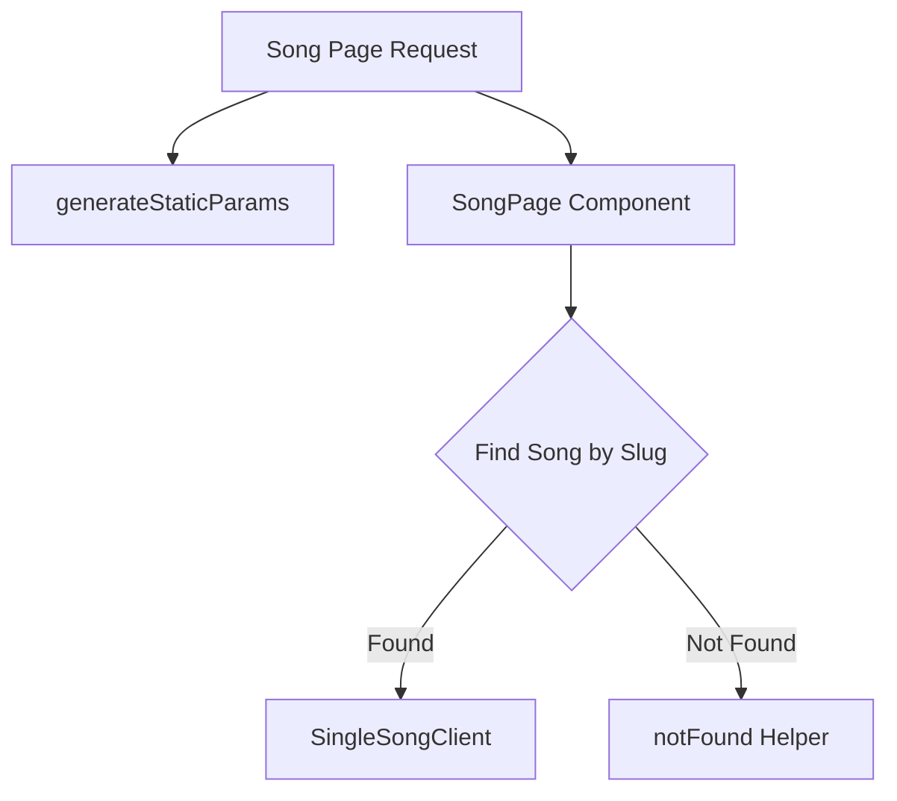

# Documentation for `page.tsx` (Single Song Page)

## 1. Overview
This file represents the individual song page. It dynamically fetches a song's details based on its slug and renders it using the `SingleSongClient` component. It also generates static params for all songs to support static site generation.

## 2. File Location
`app/songs/[slug]/page.tsx`

## 3. Key Components
- **SingleSongClient**: The client-side component that handles the video player, song details, and the "Up Next" sidebar.

## 4. Execution Flow
1. **Static Params Generation**: `generateStaticParams` fetches all songs and returns their slugs for pre-rendering.
2. **Page Rendering**:
   - Extracts the `slug` from route parameters.
   - Fetches the specific song data using `getSongBySlug(slug)`.
   - Fetches the full list of songs to provide the "Up Next" context.
   - If the song is not found, it triggers the `notFound()` helper.
3. Renders the `SingleSongClient` with the song and full list as props.

## 5. Data Flow
- **Inputs**: `params` containing the song `slug`.
- **Processing**:
  - Matches the slug against the song database.
  - Prepares the "Up Next" list by fetching all songs.
- **Outputs**: Rendered `SingleSongClient` component.
- **Dependencies**: Relies on `lib/songs` and Next.js internal routing/navigation helpers.

## 6. Mermaid Diagrams

## 7. Error Handling & Edge Cases
- **404 Handling**: Uses `notFound()` if a slug does not correspond to an existing song file.

## 8. Example Usage
Navigating to `/songs/kina-lagchha` will fetch the markdown content for that song and render this page.
