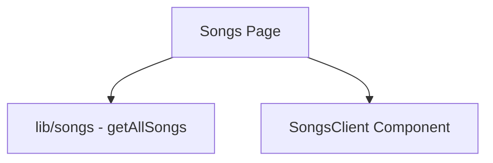

# Documentation for `page.tsx` (Songs List)

## 1. Overview
This file represents the `Worship Songs` list page of the application. It fetches all available songs and renders them using the `SongsClient` component.

## 2. File Location
`app/songs/page.tsx`

## 3. Key Components
- **SongsClient**: The client-side component that handles searching, filtering, and displaying the song grid.

## 4. Execution Flow
1. Imports `getAllSongs` from the songs library and the `SongsClient` component.
2. Fetches all song data using `getAllSongs()`.
3. Passes the fetched songs to `SongsClient` as `initialVideos`.
4. Exports the page as a default async function.

## 5. Data Flow
- **Inputs**: None (fetches data internally).
- **Processing**: Retrieves all songs from the library.
- **Outputs**: Rendered `SongsClient` component with the list of songs.
- **Dependencies**: Relies on `lib/songs` for data fetching.

## 6. Mermaid Diagrams

## 7. Error Handling & Edge Cases
- Handles cases where no songs are found by passing an empty array to `SongsClient` (which handles its own empty state).

## 8. Example Usage
Navigating to `/songs` in the browser executes this page.
