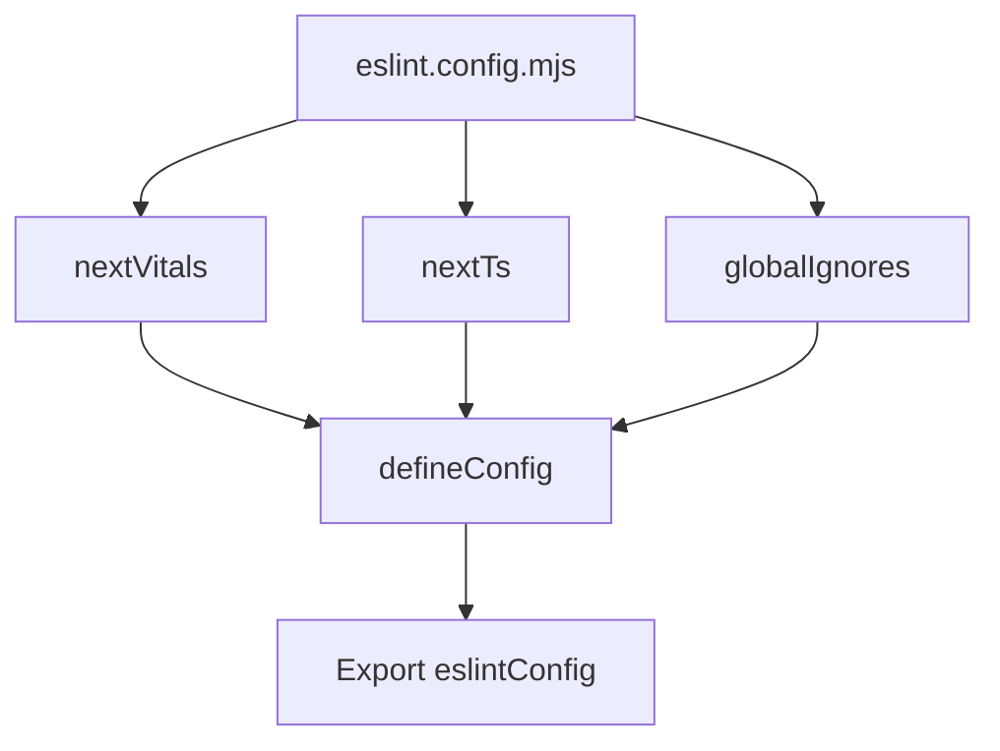

## 1. Overview

- **Purpose**: Configures ESLint for the Next.js project using Next’s core Web Vitals and TypeScript presets.
- **Problem it solves**: Centralizes linting rules and default ignore patterns for the codebase.
- **High-level responsibility**: Export a combined ESLint configuration enabling modern Next.js linting.

## 2. File Location

- Source: `eslint.config.mjs`

## 3. Key Components

- `defineConfig` and `globalIgnores` from `eslint/config`.
- `nextVitals` from `eslint-config-next/core-web-vitals`.
- `nextTs` from `eslint-config-next/typescript`.
- `eslintConfig`
  - Array-based config combining `nextVitals` and `nextTs`.
  - Overrides default ignores via `globalIgnores` to skip `.next`, `out`, `build`, and `next-env.d.ts`.
- Default export
  - Exports `eslintConfig` as the ESLint configuration.

## 4. Execution Flow

- ESLint loads `eslint.config.mjs`.
- `defineConfig` merges the Next.js configs and applies global ignore patterns.
- Tools like `npm run lint` use this configuration.

## 5. Data Flow

- **Inputs**: None at runtime; consumed by ESLint.
- **Outputs**: Configuration object for ESLint.

## 6. Mermaid Diagrams

## 7. Error Handling & Edge Cases

- Static config; errors would arise from invalid configuration values or missing packages.

## 8. Example Usage

- Invoked via `npm run lint` which runs `eslint` with this configuration.