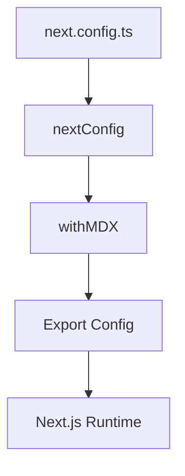

## 1. Overview

- **Purpose**: Defines core Next.js configuration, including MDX support, React compiler, page extensions, and remote image domains.
- **Problem it solves**: Central location for project-level Next.js behavior and feature flags.
- **High-level responsibility**: Configure Next.js runtime and build settings and export the MDX-wrapped config.

## 2. File Location

- Source: `next.config.ts`

## 3. Key Components

- `createMDX` and `withMDX`
  - Adds MDX support by wrapping the Next.js config.
- `nextConfig: NextConfig`
  - `reactCompiler: true` to enable React Compiler.
  - `pageExtensions`: recognizes `ts`, `tsx`, `js`, `jsx`, and `mdx` as pages.
  - `images.remotePatterns`: allows `next/image` to load images from approved external hosts (Unsplash, YouTube, Facebook CDN, etc.).
- Default export
  - Exports `withMDX(nextConfig)`.

## 4. Execution Flow

- Next.js reads this file at startup/build time.
- MDX support is enabled by `withMDX`.
- Page routing respects the configured extensions.
- Remote image optimization is allowed for whitelisted hosts.

## 5. Data Flow

- **Inputs**: None at runtime; used by Next.js tooling.
- **Outputs**: Configuration object consumed by the Next.js server and build.

## 6. Mermaid Diagrams

## 7. Error Handling & Edge Cases

- Incorrect domains or MDX config could cause build/runtime errors; handled by Next.js.

## 8. Example Usage

- Automatically used by `next dev`, `next build`, and `next start` commands.