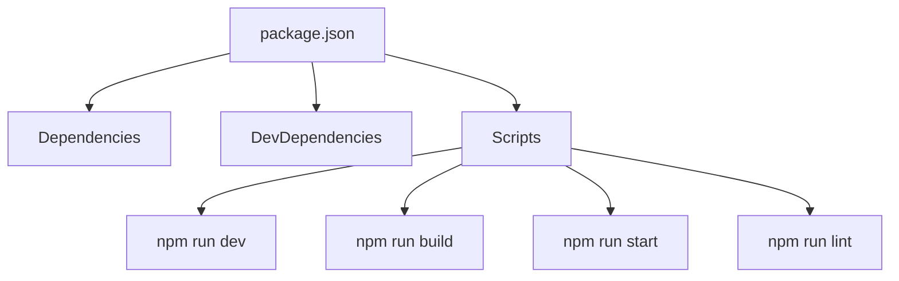

## 1. Overview

- **Purpose**: Declares project metadata, scripts, and dependencies for the Next.js app.
- **Problem it solves**: Centralizes package versions, tooling configuration, and NPM scripts.
- **High-level responsibility**: Drive install, build, dev, start, and lint operations.

## 2. File Location

- Source: `package.json`

## 3. Key Components

- `name`, `version`, `private`
  - Identifies the project and marks it as non-publishable to npm.
- `scripts`
  - `dev`: Runs `next dev` for local development.
  - `build`: Runs `next build` to create a production build.
  - `start`: Runs `next start` to serve the production build.
  - `lint`: Runs `next lint` using `eslint.config.mjs`.
- `dependencies`
  - Core: `next`, `react`, `react-dom`.
  - Content: `gray-matter`, `next-mdx-remote`, `react-markdown`.
  - UI: `framer-motion`, `lucide-react`, `react-youtube`.
  - Styling: `tailwindcss`, `@tailwindcss/typography`.
- `devDependencies`
  - TypeScript types for Node, React, React DOM.
  - ESLint and TypeScript tooling.

## 4. Execution Flow

- `npm install` / `pnpm install` uses dependencies to set up the environment.
- Scripts like `npm run dev` and `npm run build` execute the corresponding Next commands.

## 5. Data Flow

- **Inputs**: `package.json` read by package managers and tooling.
- **Outputs**: Installed node_modules and executable scripts.

## 6. Mermaid Diagrams

## 7. Error Handling & Edge Cases

- Invalid versions or missing packages surface as install or runtime errors.

## 8. Example Usage

- Run `npm run dev` to start the development server using this configuration.