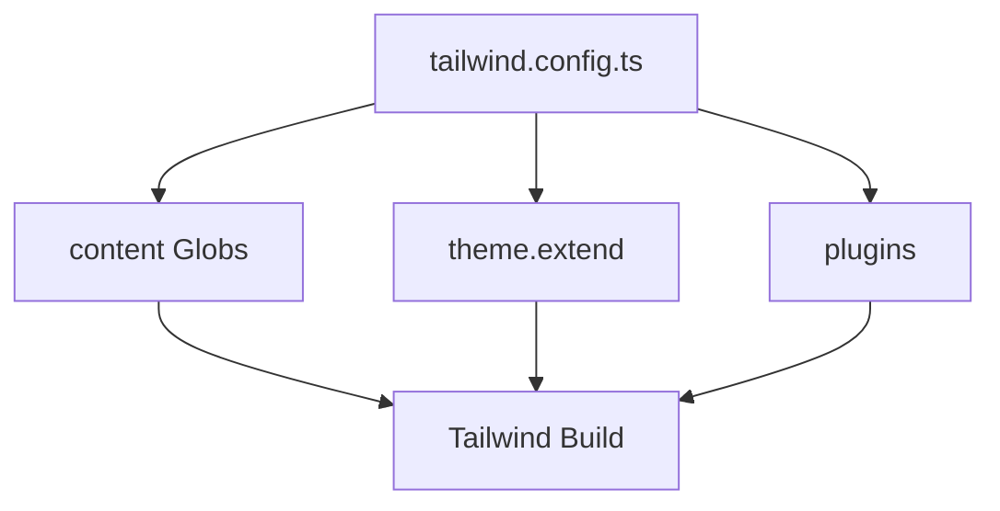

## 1. Overview

- **Purpose**: Configures Tailwind CSS for the project.
- **Problem it solves**: Declares which files Tailwind should scan for class names and which plugins/theme extensions to use.
- **High-level responsibility**: Export a Tailwind configuration with content globs and typography plugin.

## 2. File Location

- Source: `tailwind.config.ts`

## 3. Key Components

- `content`
  - Array of glob patterns where Tailwind scans for class usage:
    - `./app/**/*.{js,ts,jsx,tsx}` for App Router pages.
    - `./components/**/*.{js,ts,jsx,tsx}` for components.
- `theme`
  - Extends Tailwind’s default theme (currently empty `extend`).
- `plugins`
  - Includes `@tailwindcss/typography`.

## 4. Execution Flow

- Tailwind CLI or PostCSS loads this config during build.
- The content globs determine which classes are generated.

## 5. Data Flow

- **Inputs**: None at runtime; configuration file only.
- **Outputs**: Tailwind CSS generated based on project usage.

## 6. Mermaid Diagrams

## 7. Error Handling & Edge Cases

- If content paths are incorrect, some classes may be purged or not generated.

## 8. Example Usage

- Used implicitly by Tailwind when building styles for the project.