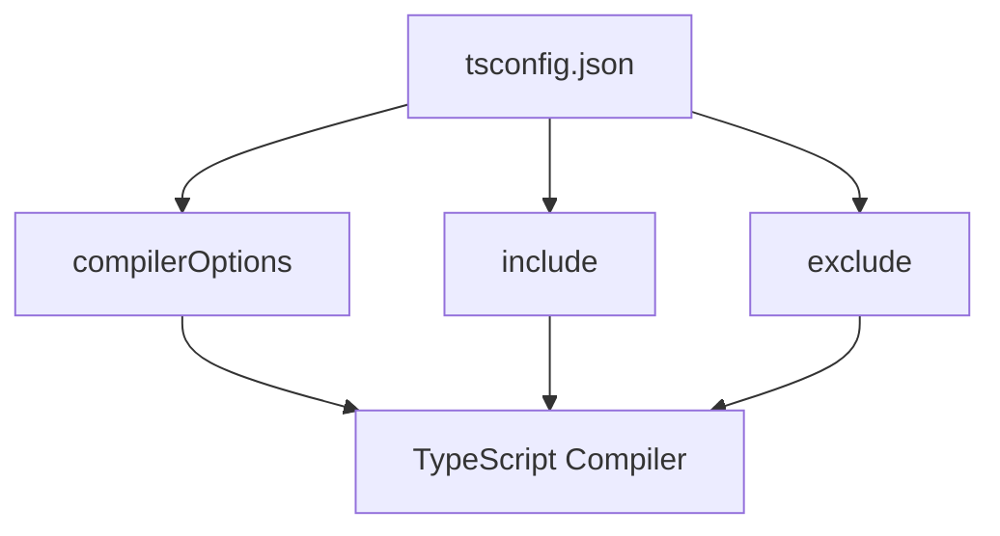

## 1. Overview

- **Purpose**: Configures TypeScript compiler options for the project.
- **Problem it solves**: Defines language level, module resolution, strictness, and path mappings for TypeScript.
- **High-level responsibility**: Provide TS settings that align with a modern Next.js app.

## 2. File Location

- Source: `tsconfig.json`

## 3. Key Components

- `compilerOptions`
  - `target`: `ES2017`.
  - `lib`: `dom`, `dom.iterable`, `esnext`.
  - `allowJs`: `true`.
  - `skipLibCheck`, `noEmit`, `esModuleInterop`, `strict`, etc.
  - `module`: `esnext`, `moduleResolution`: `bundler`.
  - `jsx`: `react-jsx`.
  - `plugins`: includes `next` TS plugin.
  - `paths`: maps `@/*` to `./src/*` (note: currently unused since there is no `src/` directory).
- `include`
  - All `*.ts`, `*.tsx`, `*.mts` files and Next.js type directories.
- `exclude`
  - `node_modules`.

## 4. Execution Flow

- TypeScript tooling (tsc, editor integrations) reads this configuration.
- Next.js uses it for type checking and IntelliSense.

## 5. Data Flow

- **Inputs**: None at runtime; config only.
- **Outputs**: TypeScript compiler behavior.

## 6. Mermaid Diagrams

## 7. Error Handling & Edge Cases

- Misconfigured paths or module settings can lead to type resolution errors, surfaced by TypeScript.

## 8. Example Usage

- Used implicitly by `tsc` and IDE tooling when working with this repo.